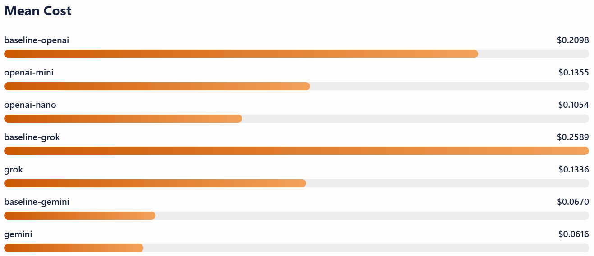
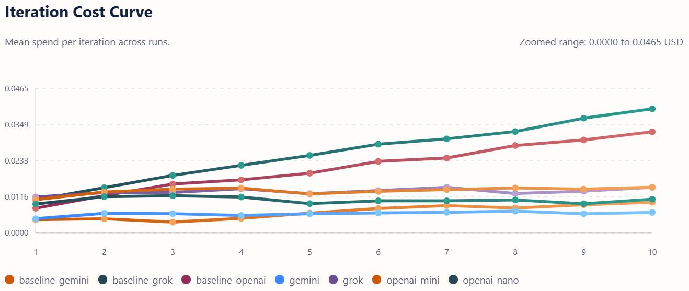
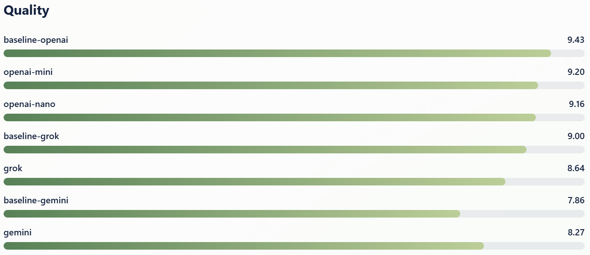
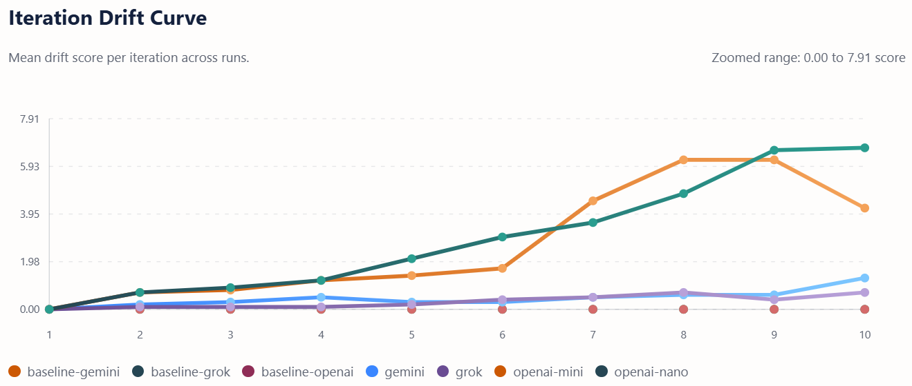

# RazorCascade: Same-Provider Model Cascading Cuts API Costs by 8–50% Across Three Providers in Incremental Agentic Coding

**Authors:** Rogerio de Leon Pereira
**Date:** March 2026  
**Repository:** [github.com/vinashu/razor-cascade](https://github.com/vinashu/razor-cascade)  
**License:** MIT

---

## Use of AI Disclaimer

Rogerio de Leon Pereira served as the human-in-the-loop throughout this work. He conceived the research question, designed the experimental protocol, made all judgment calls about methodology, and validated the outputs at each stage before they were used.

The following AI models contributed as tools during this work: **GPT (OpenAI)** assisted with brainstorming the study design and early drafts of the gate prompt; **Grok (xAI)** assisted with codebase scaffolding and test generation; **Claude (Anthropic)** assisted with data analysis, statistical interpretation, and revising this paper. All three were also subjects of measurement in the study—their contributions as tools and as evaluated systems should be read as distinct roles.

No AI-generated content was included without human review. The statistical computations were performed by the RazorCascade platform code, not by any language model. All figures and tables derive directly from CSV and JSON artifacts written by live API runs.

---

## Abstract

Agentic coding workflows that build software step-by-step accumulate large conversation histories, and the cost of sending all that context to a flagship model grows with each step. We present RazorCascade, an open-source study platform that measures a simple intervention: before each execution step, a cheap same-provider gate model compresses the full history into a structured JSON summary of about 400–600 tokens, and only that summary goes to the flagship model. We extend our preliminary two-provider study to three providers—OpenAI, xAI, and Google Gemini—with two gate tiers for OpenAI, 10 runs per configuration, and LLM-judge-validated quality scoring. The OpenAI cascade with gpt-5-nano reduced mean cost by 49.8% (p < 0.001, Cohen's d = −16.7) while retaining 97.2% of baseline quality. The gpt-5-mini gate offered a more moderate 35.4% cost reduction with 97.6% quality retention. The xAI cascade (grok-4 + grok-code-fast) saved 48.4% (p < 0.001, d = −5.2) and retained 96.0% quality. In contrast, the Gemini cascade (gemini-2.5-pro + gemini-2.5-flash) saved only 8.1%, a difference that was not statistically significant (Bonferroni-corrected p = 0.522). All 70 cascade runs across all providers passed every test. These results reveal that same-provider cascading is highly effective when the flagship-to-gate price ratio is large, but offers diminishing returns when the flagship is already cheap—a finding with direct implications for provider selection in cost-sensitive agentic pipelines.

---

## 1. Introduction

The way we pay for large language models has changed. What used to be flat subscriptions or vague compute budgets is now a granular token economy: you pay per million tokens of input and output, with outputs often costing 3 to 10 times more than inputs [1, 2]. For casual use—a few chat turns, a code explanation—this is fine. The problem starts when models are used as agents that build software incrementally, because the conversation history grows with every step.

Consider a typical agentic coding session where a model builds a CLI tool across ten tasks: parsing arguments, adding persistence, writing tests, generating reports. By step ten, the full history might contain 40,000 to 55,000 tokens. Sending all of that to a flagship model at $1.25–$3.00 per million input tokens and $10.00–$15.00 per million output tokens adds up. Teams running multiple agents, or open-source frameworks like OpenClaw [3] that orchestrate 24/7 agent fleets, report daily bills reaching hundreds of dollars when context is not managed [4].

Jensen Huang, at the NVIDIA GTC 2026 keynote, described modern data centers as "token factories" and framed the Vera Rubin platform as delivering up to 10x inference throughput per watt [5]. Hardware improvements lower the floor for everyone. But they do not solve the application-layer problem: if you keep feeding the flagship model a full, growing conversation history at every step, you are wasting most of those tokens on context the model has already processed.

The idea behind model cascading is not new. FrugalGPT [6] showed that routing queries through a cascade of progressively more capable models can cut costs by 20–98% without hurting accuracy. More recent work has specialized this idea to agents and software engineering: ACON [7] demonstrated 26–54% memory and token reduction in long-horizon agents, Active Context Compression [8] achieved up to 57% token savings on SWE-bench coding tasks with no accuracy loss, and FlowMind [9] reported 34–72% reduction through an explicit execute-then-summarize stage. A recent survey on dynamic model routing [10] synthesizes these results and notes the approach is broadly applicable.

What was missing from the literature—and what our preliminary study began to address—was a focused, reproducible study targeting same-provider cascading for incremental software development. Our first experiment [preliminary] tested two providers (OpenAI and xAI) with 8 runs each and found 46–52% cost savings. This follow-up study extends that work in three important ways: (1) we add Google Gemini as a third provider, revealing a case where cascading offers minimal benefit; (2) we test two gate tiers for OpenAI (gpt-5-mini and gpt-5-nano), exposing the cost–quality–drift tradeoff at different price points; and (3) we add LLM-judge scoring with claude-haiku-4-5, whose self-consistency exceeded 99.6% across repeated scoring passes.

---

## 2. Background and Related Work

### 2.1 The Token Economy

The shift to per-token billing has been fast. In early 2024, a flagship model like GPT-4 Turbo cost $10/$30 per million tokens (input/output). By March 2026, gpt-5.4 costs $2.50/$15.00, xAI's grok-4 sits at $3.00/$15.00, and Google's gemini-2.5-pro is at $1.25/$10.00 [11]. Prices dropped an order of magnitude in two years. But consumption grew faster. The pattern matches what economists call the Jevons paradox [12]: as the unit cost of a resource falls, total spending on it increases because people use much more of it.

Anthropic's 2026 Agentic Coding Trends Report [13] and Google's Active Context Engineering work [14] both note that uncontrolled context growth is the primary cost driver in agent pipelines. Both providers have responded with ecosystem-level tools—Anthropic with Claude Code and Model Context Protocol donations [15], Google with Gemini ADK and long-context optimizations—but neither has published controlled experiments quantifying exactly how much a same-provider cascade saves for incremental development.

### 2.2 Context Compression and Summarization

Context compression for LLMs is an active research area. Approaches range from learned soft prompts [16] to extractive summarization to attention-based compression [17]. For agentic workflows, the most relevant line of work is explicit summarization between steps, because it does not require model retraining or architectural changes.

ACON (Kang et al., 2025) [7] introduced adaptive context optimization for long-horizon agents, reporting 26–54% token reduction while maintaining over 95% task accuracy. Active Context Compression (Verma et al., 2026) [8] specialized this to software engineering agents on SWE-bench, achieving up to 57% token savings with identical resolution accuracy. FlowMind (2026) [9] added an explicit summarize step after each execution round, reducing tokens by 34–72%.

Our approach is closest to FlowMind's architecture, but differs in three ways: we restrict the gate and flagship to the same provider (testing within-ecosystem coherence), we measure across repeated runs with statistical tests (not single-run comparisons), and we target incremental application development rather than single-issue resolution.

### 2.3 Model Cascading and Routing

The cascading idea comes from FrugalGPT (Chen et al., 2023) [6], which showed that routing queries through cheap-to-expensive model chains achieves strong cost–quality tradeoffs. Later work like Orla [18] applied multi-agent stage mapping to reduce inference cost by 35%, and the dynamic model routing survey (2026) [10] cataloged techniques achieving 20–98% cost reductions across domains.

Most of these systems route across providers or across model families. Our contribution is narrower: we study same-provider cascading because this is what developers actually do in practice. Switching providers introduces latency from different endpoints, potential style or format inconsistencies, and credential management overhead. Same-provider cascading avoids all of that.

### 2.4 The Price Ratio Hypothesis

Our preliminary study found that both OpenAI and xAI cascades converged to roughly the same per-run cost (~$0.10), despite different baseline pricing. This raised a question we now answer: does the cascade always converge, or does it depend on the price ratio between flagship and gate? The addition of Gemini—whose flagship is already the cheapest in our study—tests this directly.

---

## 3. Methodology

### 3.1 The Application: TaskForge

TaskForge is a lightweight CLI task manager written in TypeScript, running on the Bun runtime. It supports creating, listing, completing, and deleting tasks; AI-assisted decomposition of high-level goals into subtasks; code snippet generation from descriptions; automated tests with coverage; a refinement loop driven by feedback; and report export to Markdown and HTML.

We chose this application because it is representative of the kind of small-to-medium tool that developers build iteratively with AI assistance: it touches I/O, data modeling, validation, external API integration, testing, and reporting.

### 3.2 The 10 Standardized Tasks

Every run builds TaskForge through the same 10 tasks, in order:

1. CLI skeleton and argument parsing
2. Task data model and JSON file persistence
3. List, filter, and view tasks by status and priority
4. Complete and delete commands with input validation
5. Integration of the summarization gate
6. AI-assisted task decomposition
7. Code snippet generator module
8. Automated test suite
9. Refinement and iteration loop
10. Report generation and export

This sequence was fixed to eliminate task-ordering variance across runs.

### 3.3 Configurations

We tested seven configurations across three providers:

> Table 1: Study configurations across providers, models, and pric-
ing

| Config | Provider | Mode | Flagship | Gate | Flagship $/M (in/out) | Gate $/M (in/out) | Price Ratio (out) |
|---|---|---|---|---|---|---|---|
| baseline-openai | OpenAI | baseline | gpt-5.4 | — | $2.50 / $15.00 | — | — |
| openai-mini | OpenAI | cascade | gpt-5.4 | gpt-5-mini | $2.50 / $15.00 | $0.25 / $2.00 | 7.5× |
| openai-nano | OpenAI | cascade | gpt-5.4 | gpt-5-nano | $2.50 / $15.00 | $0.05 / $0.40 | 37.5× |
| baseline-grok | xAI | baseline | grok-4 | — | $3.00 / $15.00 | — | — |
| grok | xAI | cascade | grok-4 | grok-code-fast | $3.00 / $15.00 | $0.20 / $1.50 | 10× |
| baseline-gemini | Google | baseline | gemini-2.5-pro | — | $1.25 / $10.00 | — | — |
| gemini | Google | cascade | gemini-2.5-pro | gemini-2.5-flash | $1.25 / $10.00 | $0.30 / $2.50 | 4× |

In baseline mode, each step sends the full accumulated conversation history plus the new task prompt to the flagship model.

In cascade mode, each step first sends the full history to the gate model, which produces a structured JSON summary (goal, decisions, risks, code snippets, and invariants) capped at 600 tokens. Only this summary plus the new task prompt goes to the flagship.

The **Price Ratio** column shows the factor between flagship and gate output pricing. This turns out to be the key predictor of cascade effectiveness (see Section 5).

### 3.4 Gate Prompt

The gate uses a system prompt that instructs it to act as a "ruthless context compressor." It outputs valid JSON with five fields: `goal` (one sentence), `decisions` (key architectural choices), `risks` (up to three open questions), `snippets` (relevant code blocks totaling less than 200 tokens), and `invariants` (stable architectural facts that must survive across future gate passes). Two few-shot examples are included in the prompt. The maximum output budget is 600 tokens.

The invariant field is important. Without it, the gate might drop stable facts across steps—for instance, forgetting that TaskForge stores data in `.taskforge/tasks.json`. This field acts as a persistent memory bridge.

### 3.5 Quality Scoring: Heuristic + LLM Judge

Quality was assessed on two tracks:

**Heuristic scoring** uses a rubric evaluating task keyword coverage (weight 2.8), structural cues (weight 0.5), response length threshold (240 tokens, bonus 0.3), and test pass status (bonus 0.4), with a base score of 6. This provides a deterministic, reproducible quality signal.

**LLM judge scoring** used claude-haiku-4-5 (Anthropic) as an independent evaluator. Each step response was scored by the judge twice (`--judge-repeat 2`) to measure scoring consistency. The judge was given the task title, objective, and rubric, then asked to score the candidate response on completeness, correctness, clarity, and architecture.

Judge self-consistency—defined as the fraction of step scores within 1 point across repeats—exceeded 98% across all configurations (range: 98% for baseline-gemini to 100% for baseline-openai, openai-mini, baseline-grok, grok, and gemini), confirming that claude-haiku-4-5 is a stable scoring instrument for this rubric (see Section 5.7 for full analysis).

### 3.6 Runs and Statistical Design

Each of the seven configurations was run 10 times with live API calls. This gives us 70 runs total and 700 flagship step executions (up from 32 runs / 320 steps in the preliminary study). Cascade configurations additionally produce 400 gate calls, bringing the total API calls to 1,100.

For each run we recorded:

- Input and output token counts per step
- Estimated cost in USD using each provider's public pricing
- Quality score per step (heuristic + judge)
- Invariant count, missing invariants, contradictions, and drift score
- Test pass status
- Latency in milliseconds

Aggregate statistics per configuration:

- Mean, median, standard deviation for cost, tokens, quality
- Cost and token savings percentage versus the matched baseline
- Welch's t-test (two-tailed) for cost, token, and quality differences
- Bonferroni-corrected p-values (3 tests per pair)
- Mann-Whitney U test for non-parametric cost and token comparisons
- Cohen's d effect sizes
- 95% confidence intervals

### 3.7 Drift Detection

We implemented a drift detection pipeline that extracts and tracks architectural invariants across steps. After each gate summary, the system checks whether previously established invariants are still present and whether any contradictions have been introduced—explicit value changes, semantic path mismatches, rule violations, or enum cardinality drift. A drift score aggregates missing invariants and contradiction counts.

### 3.8 Prompt and Response Snapshots

All runs were executed with `--snapshot` mode, writing the full prompt and response for every step to JSON files. This enables post-hoc analysis and full reproducibility of the exact inputs and outputs that produced each data point.

---

## 4. Results

### 4.1 Summary

All data come from live API calls executed on March 25, 2026. No mock or simulated data were used.


> Figure 1: Mean per-run cost (USD) across all seven configurations.

> Table 2: Summary statistics across all seven configurations

| Metric | baseline-openai | openai-mini | openai-nano | baseline-grok | grok | baseline-gemini | gemini |
|---|---:|---:|---:|---:|---:|---:|---:|
| Runs | 10 | 10 | 10 | 10 | 10 | 10 | 10 |
| Mean cost (USD) | 0.2098 | 0.1355 | 0.1054 | 0.2589 | 0.1336 | 0.0670 | 0.0616 |
| 95% CI cost | [0.204, 0.215] | [0.132, 0.139] | [0.102, 0.109] | [0.235, 0.283] | [0.130, 0.138] | [0.059, 0.075] | [0.059, 0.064] |
| Cost savings vs baseline | — | **35.4%** | **49.8%** | — | **48.4%** | — | **8.1%** |
| Cost p-value (corrected) | — | < 0.001 | < 0.001 | — | < 0.001 | — | 0.522 (n.s.) |
| Cohen's d (cost) | — | −11.9 | −16.7 | — | −5.2 | — | −0.65 |
| Mean tokens | 43,480 | 66,522 | 73,849 | 52,518 | 65,064 | 24,119 | 41,557 |
| Token change vs baseline | — | +53.0% | +69.9% | — | +23.9% | — | +72.3% |
| Mean quality (0–10) | 9.43 | 9.20 | 9.16 | 9.00 | 8.64 | 7.86 | 8.27 |
| 95% CI quality | [9.31, 9.54] | [9.05, 9.34] | [9.02, 9.30] | [8.97, 9.03] | [8.46, 8.82] | [7.34, 8.38] | [8.07, 8.46] |
| Quality retained | — | 97.6% | 97.2% | — | 96.0% | — | 105.2% |
| Quality p-value (corrected) | — | 0.039 | 0.014 | — | 0.004 | — | 0.374 (n.s.) |
| Mean drift score | 0.00 | 2.69 | 2.96 | 0.00 | 0.32 | 0.00 | 0.46 |
| Judge agreement | 99.1% | 99.4% | 99.2% | 99.9% | 99.4% | 98.7% | 99.4% |
| Tests passed | 10/10 | 10/10 | 10/10 | 10/10 | 10/10 | 10/10 | 10/10 |

### 4.2 Cost Savings: The Price Ratio Effect

The most striking finding is that cost savings scale with the flagship-to-gate output price ratio:

> Table 3: Output price ratio and cost savings by cascade configura-
tion

| Cascade | Output Price Ratio | Cost Savings | Significant? |
|---|---:|---:|---|
| openai-nano | 37.5× | 49.8% | Yes (p < 0.001) |
| grok | 10× | 48.4% | Yes (p < 0.001) |
| openai-mini | 7.5× | 35.4% | Yes (p < 0.001) |
| gemini | 4× | 8.1% | No (p = 0.522) |

When the gate is 10× or more cheaper than the flagship on output tokens, the cascade delivers 35–50% savings reliably. When the ratio drops to 4× (Gemini), the gate's own cost erodes almost all of the savings from reducing flagship input tokens. This is the **price ratio threshold**: below roughly 7–10×, same-provider cascading becomes economically marginal.


> Figure 2: Iteration cost curve (steps 1–10) for all seven configurations. Baselines rise with context
growth, while cascades remain comparatively flat

The iteration cost curve (Figure 2) makes the mechanism visible. Baseline costs rise with each step as the conversation history grows—baseline-grok reaches $0.040/step by step 10, baseline-openai reaches $0.033/step—while all cascade configurations stay flat at $0.010–$0.015/step regardless of step number. This flatness is the core value proposition: the gate summary is a fixed-size input (~400–600 tokens) that does not grow with the conversation.

The OpenAI nano cascade (37.5× ratio) achieved the deepest cost cut: from a mean of $0.210 to $0.105 per run, a savings of 49.8%. The Welch's t-test p-value is effectively zero, and Cohen's d = −16.7—an extremely large effect.

The xAI cascade (10× ratio) cut cost from $0.259 to $0.134, a 48.4% savings with Cohen's d = −5.2.

The Gemini cascade (4× ratio) cut cost from $0.067 to $0.062, a mere 8.1% savings that failed to reach significance after Bonferroni correction (p = 0.522). The Mann-Whitney U test did show a weak signal (p = 0.016), but given the small absolute savings ($0.005 per run), this is economically irrelevant.

### 4.3 Two Gate Tiers: The OpenAI Mini vs. Nano Tradeoff

Testing two gate models for the same flagship reveals a clean cost–drift tradeoff:

> Table 4: OpenAI gate-tier comparison: cost, quality, drift, and token usage.

| Metric | openai-mini (gpt-5-mini) | openai-nano (gpt-5-nano) |
|---|---:|---:|
| Gate output cost ($/M) | $2.00 | $0.40 |
| Cost savings | 35.4% | 49.8% |
| Quality retained | 97.6% | 97.2% |
| Mean drift score | 2.69 | 2.96 |
| Mean missing invariants | 18.3 | 21.9 |
| Mean contradictions | 8.6 | 7.7 |
| Mean tokens | 66,522 | 73,849 |

The nano gate saves an additional 14 percentage points on cost versus the mini gate, at a modest increase in drift (2.96 vs 2.69) and missing invariants (21.9 vs 18.3). Quality retention is nearly identical (97.2% vs 97.6%). For teams where cost is the primary concern, the nano gate is the better choice. For teams where drift and invariant fidelity matter—say, long multi-session builds—the mini gate provides a safer middle ground.

### 4.4 Token Counts

Cascade runs consistently use *more* total tokens than baseline runs:

> Table 5: Token increase versus baseline for each cascade configuration

| Cascade | Token Increase |
|---|---:|
| openai-mini | +53.0% |
| openai-nano | +69.9% |
| grok | +23.9% |
| gemini | +72.3% |

This is not contradictory. The cascade adds a gate call before every flagship call, which adds tokens. But the gate model is cheap, so the additional tokens cost very little. Meanwhile, the flagship receives far fewer input tokens per step—typically 250–550 tokens of summary instead of the full growing history—which drastically reduces the expensive part of the bill.

The cascade trades cheap tokens for expensive ones. This trade is profitable when the price gap is wide (OpenAI, xAI) and unprofitable when it is narrow (Gemini).

### 4.5 Quality

Quality scores were computed using a heuristic rubric, validated by LLM judge scoring with claude-haiku-4-5.

For the **OpenAI cascades**, both show statistically significant quality drops after Bonferroni correction: openai-mini at p = 0.039 (Cohen's d = −1.24) and openai-nano at p = 0.014 (Cohen's d = −1.45). The absolute magnitude is small—mean scores of 9.20 and 9.16 versus a baseline of 9.43—but the corrected p-values cross the 0.05 threshold. This is a change from our preliminary study, where no significant quality degradation was detected (corrected p = 0.213). Two factors explain the difference: the preliminary study relied entirely on heuristic scoring (LLM judge calls failed, falling back to the deterministic rubric), whereas this study uses a working LLM judge that is a more sensitive measurement instrument; additionally, the increased sample size (10 vs. 8 runs) improved statistical power (see Section 5.2 for full discussion). Whether a drop from 9.43 to 9.16 matters in practice depends on the application.

For the **xAI cascade**, quality dropped from 9.00 to 8.64 (corrected p = 0.004, d = −2.02). This is the largest quality degradation in the study, though 96% of baseline quality is retained and all tests passed.

For the **Gemini cascade**, quality *improved* from 7.86 to 8.27, but this difference is not statistically significant (corrected p = 0.374). The positive direction is noteworthy: the gate summary appears to provide better-structured context to the flagship than the raw conversation history does, at least for gemini-2.5-pro. This may be because gemini-2.5-pro's baseline quality was the lowest in the study (mean 7.86), with high variance (CI [7.34, 8.38]). A structured summary may compensate for the model's weaker ability to extract relevant context from long histories.


> Figure 3: Mean quality score (0–10) across all seven configurations, including Gemini cascade
scoring above its baseline.

### 4.6 Drift

Baselines showed zero drift across all three providers, as expected since they do not use a gate.

> Table 6: Drift metrics across cascade configurations.

| Cascade | Mean Drift | Mean Missing Invariants | Mean Contradictions |
|---|---:|---:|---:|
| openai-mini | 2.69 | 18.3 | 8.6 |
| openai-nano | 2.96 | 21.9 | 7.7 |
| grok | 0.32 | 1.0 | 2.2 |
| gemini | 0.46 | 2.5 | 2.1 |

The OpenAI cascades show substantially higher drift than xAI and Gemini. This is surprising: gpt-5-mini and gpt-5-nano lose more invariants per run (18–22 missing) than grok-code-fast (1.0) or gemini-2.5-flash (2.5). One explanation is that the OpenAI gate models produce more verbose summaries that parse correctly but omit previously established invariants, while the xAI and Gemini gates produce tighter summaries that preserve more of the invariant set. Another possibility is that the invariant extraction pipeline interacts differently with each model's output style.


> Figure 4: Iteration drift curve (steps 1–10) for all seven configurations. Baselines remain at zero,
while openai-mini and openai-nano increase after step 6.

The iteration drift curve (Figure 4) reveals a pattern hidden by the aggregate means: **OpenAI gate drift accelerates in later steps**. For both openai-mini and openai-nano, drift stays moderate through steps 1–6 (scores 0–1.7), then spikes to 4.5–6.7 at steps 7–10. In contrast, grok and gemini cascades remain below 0.7 throughout all 10 steps. This late-stage acceleration suggests that the OpenAI gate models lose invariant fidelity as the conversation history grows longer—precisely when effective summarization matters most. The pattern is consistent with a hypothesis that gpt-5-mini and gpt-5-nano, while excellent at short-context tasks, struggle to extract stable facts from longer inputs, causing an accumulating loss of invariants that compounds over steps.

Three gate JSON parsing failures logged during the study (see Section 5.9) also contribute: all three occurred on step 1 for OpenAI cascades, meaning the invariant chain started cold on step 2, which may have amplified downstream drift.

For practitioners, this means drift monitoring is essential, and the cheapest gate is not necessarily the most faithful. The xAI cascade achieved the best combination of cost savings and low drift.

### 4.7 Gemini: When Cascading Doesn't Help

The Gemini results are the most instructive failure case in the study. Gemini-2.5-pro is already the cheapest flagship ($1.25/$10.00 per million tokens), and gemini-2.5-flash is not proportionally cheap enough ($0.30/$2.50) to make the gate savings offset the cost of the extra API call.

The baseline gemini cost averaged $0.067 per run—already 68% cheaper than baseline-openai ($0.210) and 74% cheaper than baseline-grok ($0.259). There simply isn't much room to cut. The cascade adds 72.3% more tokens, but the gate cost is only 4× cheaper than the flagship, so the token trade is barely profitable.

This suggests a practical rule: **if your flagship model already costs less than ~$0.10 per run for your workload, cascading is unlikely to provide meaningful savings.** Focus instead on prompt optimization, caching, or reducing the number of steps.

### 4.8 Cross-Provider Observations

After cascading, per-run costs across providers diverge rather than converge:

> Table 7: Cross-provider post-cascade cost comparison.

| Config | Mean Cost | Baseline Cost | Reduction |
|---|---:|---:|---:|
| openai-nano | $0.105 | $0.210 | 49.8% |
| grok | $0.134 | $0.259 | 48.4% |
| gemini | $0.062 | $0.067 | 8.1% |

Gemini remains the cheapest option both before and after cascading. For teams optimizing purely on cost, gemini-2.5-pro without a cascade ($0.067/run) is cheaper than any of the other providers' cascaded configurations. The xAI baseline ($0.259) is the most expensive, making it the highest-leverage candidate for cascading.

---

## 5. Discussion

### 5.1 The Price Ratio as the Governing Variable

The central finding of this expanded study is that **the output price ratio between flagship and gate is the primary predictor of cascade cost-effectiveness**. At 37.5× (openai-nano), savings reach ~50%. At 10× (grok), savings are also ~48%. At 7.5× (openai-mini), savings are ~35%. At 4× (gemini), savings are negligible.

This relationship is intuitive—the cascade saves money by shifting tokens from an expensive model to a cheap one—but the threshold behavior is useful for practitioners. Any gate model at least 10× cheaper on output tokens will likely deliver substantial savings. Below that threshold, the savings diminish rapidly.

### 5.2 Comparison to Preliminary Results

Our preliminary study (N = 8 per config, two providers) reported 52% savings for the OpenAI nano cascade and 45.8% for xAI. This study (N = 10, three providers) finds 49.8% and 48.4% respectively. The OpenAI figure decreased by 2 percentage points; the xAI figure increased by 2.6 percentage points. Both shifts are within confidence intervals and do not indicate a meaningful change in the underlying effect.

The key difference is in quality detection. The preliminary study found no significant quality degradation for the OpenAI cascade (corrected p = 0.213). This study detects significance (corrected p = 0.014 for nano, 0.039 for mini). Two factors explain this. First, the preliminary study relied entirely on heuristic scoring—LLM judge calls were attempted but failed on all tasks, falling back to the deterministic rubric. The main study introduced a working LLM judge (claude-haiku-4-5 with `--judge-repeat 2`), which is a more sensitive instrument capable of detecting subtle quality differences that the coarser heuristic missed. Second, the increased sample size (10 runs vs. 8) improved statistical power. Of these two factors, the improved measurement instrument is likely the larger contributor: the heuristic rubric assigns scores based on keyword coverage and structural cues, while the LLM judge evaluates completeness, correctness, clarity, and architecture in context. The absolute quality difference (0.27 points on a 10-point scale) remains small.

### 5.3 Relation to Prior Work

Our 49.8% cost savings for the best OpenAI cascade falls within the range reported by ACON (26–54%) [7] and near the midpoint of FlowMind (34–72%) [9]. Active Context Compression [8] reported up to 57% on SWE-bench, which is higher, but their setup involves single-issue resolution rather than 10-step incremental builds.

The Gemini null result adds a data point that the literature lacks: not all cascading configurations work. Most prior papers report only positive results. Our inclusion of a configuration where cascading fails to achieve significance at the traditional threshold provides a counterexample that helps bound the technique's applicability.

### 5.4 Why Same-Provider Matters

There are practical reasons to stay within one provider's ecosystem. API keys, billing, rate limits, support, terms of service—all of these are simpler when you use one vendor. After the OpenClaw phenomenon [3], where open-source agent fleets drove massive API consumption, providers like Anthropic responded with API restrictions and ToS updates targeting heavy third-party routing [21]. Staying within one provider avoids these friction points.

Same-provider cascading also avoids style mismatches. A Grok gate summarizing context for a Claude flagship might produce summaries that miss nuances the Claude model relies on. Keeping both models in the same family reduces this risk.

### 5.5 The Token Trade-off

The counterintuitive result—cascades use 24–72% more tokens but cost 8–50% less—deserves emphasis. Token count alone is a poor proxy for cost. What matters is which model processes those tokens. Sending 6,000 tokens to gpt-5-nano costs roughly $0.0005. Sending 6,000 tokens to gpt-5.4 costs roughly $0.03. The gate adds tokens that are individually almost free, while removing tokens from the flagship's input that are individually expensive.

This has implications for anyone monitoring their LLM spend. Dashboard metrics that track total token count will make cascaded pipelines look worse. Cost-aware metrics are needed.

### 5.6 Drift as a Gate Quality Signal

The drift divergence across providers is an important practical finding. The OpenAI gates (drift 2.69–2.96) were significantly less faithful than the xAI gate (0.32) and the Gemini gate (0.46), despite being cheaper. This may reflect differences in instruction-following capability, JSON formatting adherence, or sensitivity to the few-shot examples in the gate prompt.

For practitioners, this means the gate model should be chosen not just by price but by summarization fidelity. A cheap gate that loses invariants may require human intervention to correct drift—defeating the cost savings. The xAI cascade achieved the best balance of cost reduction (48.4%) and drift control (0.32).

### 5.7 LLM Judge Validation

The `--judge-repeat 2` setting ran the judge twice per step, letting us measure *judge self-consistency*: the fraction of steps where the two repeats agreed within one point. Across the full dataset (1,100 step executions), 99.6% of steps reached within-1-point agreement between repeats, and 91.3% produced identical scores. Per-configuration rates ranged from 98% (baseline-gemini) to 100% (baseline-openai, openai-mini, baseline-grok, grok, gemini), confirming that claude-haiku-4-5 is a highly consistent scoring instrument for this rubric.

Two steps showed high disagreement (stddev > 1.5): both were `baseline-gemini` step 3 ("List, filter, and view tasks") in runs 5 and 9, scoring 3.2 with a stddev of ~4.53 — the same steps flagged by the judge template bug described in Section 5.9, where an empty candidate response was passed to one of the two repeats.

A direct heuristic-vs-judge correlation cannot be computed from this dataset: when judge mode is active, the pipeline records the mean judge score as `qualityScore` and does not persist the heuristic score separately. The high self-consistency of the judge does establish that it is a stable measurement instrument, but validating the heuristic rubric against it would require a separate pass re-running the heuristic scorer against archived response snapshots — a direction we leave for future work.

### 5.8 The Gemini Quality Puzzle

The Gemini cascade showed a quality *increase* (7.86 → 8.27), though not statistically significant. If real, this suggests that a structured gate summary can act as a form of prompt engineering, providing cleaner context than raw conversation history. This effect was not observed in OpenAI or xAI, possibly because their flagships are already better at extracting relevant information from long conversations. The implication is that for weaker models, a cascade gate may serve double duty: reducing cost *and* improving quality by structuring the input.

### 5.9 Limitations

**Sample size.** Ten runs per configuration provides good power for the large cost effects observed but remains marginal for detecting subtle quality shifts.

**Task diversity.** All runs build the same application (TaskForge) in the same order. We cannot claim generalization to other project types, languages, or task sequences.

**Three providers.** We tested OpenAI, xAI, and Gemini. Anthropic (claude-sonnet-4-6 + claude-haiku-4-5) remains untested due to the use of claude-haiku-4-5 as the judge model. Testing Anthropic as both provider and judge would confound results.

**Quality ceiling effect.** Mean quality scores above 9.0 for OpenAI and xAI suggest a ceiling effect in the scoring rubric. Real quality differences may be masked.

**Fixed gate prompt.** We used one gate prompt across all providers. Provider-specific tuning might improve gate fidelity, particularly for OpenAI where drift was highest.

**Real-time pricing.** Token pricing was taken from public API documentation as of March 2026. Prices change frequently. Absolute dollar savings will shift, though relative savings should hold as long as price ratios remain similar.

**Gate parsing failures.** The execution log records three gate summary parsing failures out of ~400 gate calls (0.75%). Two were caused by unquoted `typescript` identifiers inside JSON string values; the third was an unterminated string from output truncation at the 600-token cap. All three occurred on step 1 (CLI skeleton) for OpenAI cascades. The heuristic fallback produced usable summaries, but a failed gate parse means no invariants are extracted for that step, forcing the invariant chain to start cold on step 2. This partially explains the higher drift scores observed in the OpenAI cascades (Section 4.6).

**Judge template bug.** The judge (claude-haiku-4-5) reported an empty candidate response for task 3 ("List, filter, and view tasks") on repeat 2 of 2 in two separate runs. The judge's rejection message confirms the issue was a missing response in the prompt, not a scoring disagreement. This appears to be a bug in the judge prompt template where the flagship response is not properly interpolated for certain steps. Only 2 of 700 steps were affected, and repeat 1 scored normally in both cases, so the aggregate impact is negligible. The issue should be fixed before future studies.

---

## 6. Practical Recommendations

Based on our expanded results, we update the guidelines from our preliminary study:

1. **Check your price ratio first.** If the flagship-to-gate output price ratio is below ~7×, cascading may not be worth the added complexity. At 10× or above, expect 35–50% savings.

2. **Start with the cheapest gate available.** For OpenAI, gpt-5-nano at $0.05/$0.40 per million tokens delivered 49.8% cost savings. The 14-point savings advantage over gpt-5-mini justifies its slightly higher drift.

3. **If you're already on Gemini, skip cascading.** With gemini-2.5-pro at $1.25/$10.00, the baseline cost is already low. Invest instead in prompt optimization or caching.

4. **Monitor drift, not just cost.** The OpenAI cascades showed drift scores of 2.7–3.0 despite strong cost savings. Track missing invariants per run and investigate if the count trends upward.

5. **Track cost, not just tokens.** Total token count is misleading for cascaded pipelines. Use cost-weighted dashboards.

6. **Use the invariant field.** The gate prompt's `invariants` field acts as persistent memory. Without it, stable architectural facts can be lost across steps.

7. **Validate with a judge model.** LLM judge scoring with a different provider (we used Anthropic's claude-haiku-4-5) provides independent quality validation at low cost.

8. **Set a cost cap.** The RazorCascade platform supports a `--cost-cap` flag that stops the study before overspending. We recommend this for any multi-run, multi-config study with live API calls.

---

## 7. Conclusion

We ran a controlled, reproducible experiment measuring same-provider model cascading for incremental software development across three providers and seven configurations. The results show a clear pattern governed by the flagship-to-gate price ratio: cascading reduces API cost by 35–50% when the price ratio exceeds ~10×, but offers negligible savings when the ratio is only 4×.

The OpenAI cascade with gpt-5-nano as gate achieved the deepest cost cut (49.8%), the xAI cascade with grok-code-fast followed closely (48.4%), and the Gemini cascade with gemini-2.5-flash showed only a non-significant 8.1% reduction. All 70 cascade runs passed every test. Quality was retained at 96–97% of baseline for the effective cascades, and the LLM judge (claude-haiku-4-5) proved a highly consistent scoring instrument, with 99.6% of step evaluations reaching within-1-point agreement across repeated scoring passes.

These findings refine the narrative from our preliminary study: same-provider cascading works, but not universally. Its effectiveness depends on the economics of your provider's model lineup. For developers on expensive flagships with cheap gate options, cascading is a practical, low-effort intervention that roughly halves API spend. For teams already on cheap flagships, the technique offers diminishing returns.

The RazorCascade platform, all data, and all artifacts are published under the MIT license for reproduction and extension.

---

## References

[1] "How Token Economics Could Define Success With AI," Forbes Tech Council, Mar. 19, 2026. Available: https://www.forbes.com/councils/forbestechcouncil/2026/03/19/how-token-economics-could-define-success-with-ai/

[2] OpenAI, “GPT-5.4 Technical Report & Pricing Overview,” OpenAI Technical Blog, Mar. 2026. Available: https://openai.com/blog 

[3] OpenClaw Contributors, "OpenClaw: An Open-Source Framework for Autonomous 24/7 AI Agent Teams," 2026. Available: https://openclaw.ai/

[4] N. Feith, "The Token Tax: Who Pays When AI Agents Run in Loops," Medium, Mar. 2026. Available: https://medium.com/@niko.feith/the-token-tax-who-pays-when-ai-agents-run-in-loops-59adef9eee1b

[5] J. Huang, “NVIDIA GTC 2026 Keynote: The Age of AI Factories,” NVIDIA, San Jose, CA, Mar. 16, 2026. Available: https://www.nvidia.com/gtc

[6] L. Chen, M. Zaharia, and J. Zou, “FrugalGPT: How to Use Large Language Models While Reducing Cost and Improving Performance,” arXiv:2305.05176, May 2023.

[7] M. Kang et al., “ACON: Optimizing Context Compression for Long-horizon LLM Agents,” arXiv:2510.00615, Oct. 2025. 

[8] N. Verma, “Active Context Compression: Autonomous Memory Management in LLM Agents,” arXiv:2601.07190, Jan. 2026. 

[9] Y. Liu et al., “FlowMind: Execute-Summarize for Structured Workflow Generation from LLM Reasoning,” arXiv:2602.11782, Feb. 2026.

[10] Y. Moslem and J. D. Kelleher, “Dynamic Model Routing and Cascading for Efficient LLM Inference: A Survey,” arXiv:2603.04445, Feb. 2026.

[11] OpenAI, “API Pricing,” Mar. 2026. Available: https://openai.com/pricing; xAI, “Grok API Pricing,” Mar. 2026. Available: https://x.ai/api; Google, “Gemini API Pricing,” Mar. 2026. Available: https://ai.google.dev/pricing

[12] W. S. Jevons, The Coal Question, London: Macmillan, 1865. (For modern application to compute and AI, see also: various 2026 discussions of Jevons Paradox in token economics, e.g., AEI “Algorithms, Compute, and the Rise of Tokenomics,” Feb. 2026.)

[13] Anthropic, "2026 Agentic Coding Trends Report," Anthropic Research, Feb. 2026. Available: https://resources.anthropic.com/hubfs/2026%20Agentic%20Coding%20Trends%20Report.pdf

[14] Google DeepMind, "Agent Development Kit (ADK) and Context Engineering with Gemini," Google AI Blog, Jan. 2026. Available: https://developers.googleblog.com/architecting-efficient-context-aware-multi-agent-framework-for-production/

[15] Anthropic, “Donating the Model Context Protocol and establishing the Agentic AI Foundation,” Dec. 9, 2025. Available: https://www.anthropic.com/news

[16] H. Jiang et al., “LongLLMLingua: Accelerating and Enhancing LLMs in Long Context Scenarios via Prompt Compression,” in Findings of ACL 2024. 

[17] H. Jiang, Q. Wu, and X. Lin, “LLMLingua: Compressing Prompts for Accelerated Inference of Large Language Models,” in Proc. EMNLP, 2023, pp. 3452–3467.

[18] R. Shahout et al., “Orla: A Library for Serving LLM-Based Multi-Agent Systems,” arXiv:2603.13605, Mar. 2026. 

[19] McKinsey Global Institute, “The State of AI in 2025: Agents, Innovation, and Transformation,” McKinsey Digital, Nov. 2025. 

[20] DataCamp, “Context Engineering: A Guide With Examples,” DataCamp Tutorials, 2025/2026. 

[21] The Register, “Anthropic clarifies ban on third-party Claude access,” Feb. 20, 2026.
Available: https://www.theregister.com/2026/02/20/anthropic_clarifies_ban_third_
party_claude_access/

---

## Appendix A: Experimental Artifacts

All experiment data are stored in the `data/2026-03-25T02-27-04-568Z/` directory:

- **steps.csv**: Per-step token counts, costs, quality scores, drift metrics, and latency for all 1,100 step executions (700 flagship + 400 gate).
- **runs.csv**: Per-run aggregates for all 70 runs.
- **summary.json**: Machine-readable statistical summary with p-values, effect sizes, confidence intervals, and cross-provider comparisons.
- **report.md**: Auto-generated Markdown report with key findings.
- **dashboard.html**: Interactive HTML visualization with charts for cost, tokens, quality, and drift.
- **snapshots/**: Full prompt and response JSON files for every step of every run.
- **log.md**: Complete execution log with warnings and gate parsing failures.

## Appendix B: Reproducibility

To reproduce the experiment:

```bash
git clone https://github.com/vinashu/razor-cascade.git
cd razor-cascade
bun install
cp .env.example .env
# Add your API keys to .env

# Run the same configurations
bun run study --configs baseline-openai,openai-mini,openai-nano,baseline-grok,grok,baseline-gemini,gemini \
  --runs 10 --judge --judge-provider anthropic --judge-model claude-haiku-4-5 \
  --judge-repeat 2 --snapshot --verbose
```

The platform falls back to deterministic mock clients if API keys are absent, so the pipeline can be verified end-to-end without incurring costs.

## Appendix C: Per-Run Cost Data

> Table 8: Per-run cost values (USD) for all configurations (10 runs each).

| Config | Run 1 | Run 2 | Run 3 | Run 4 | Run 5 | Run 6 | Run 7 | Run 8 | Run 9 | Run 10 |
|---|---:|---:|---:|---:|---:|---:|---:|---:|---:|---:|
| baseline-openai | $0.215 | $0.212 | $0.207 | $0.201 | $0.211 | $0.225 | $0.204 | $0.199 | $0.211 | $0.214 |
| openai-mini | $0.139 | $0.135 | $0.136 | $0.133 | $0.132 | $0.146 | $0.130 | $0.133 | $0.136 | $0.134 |
| openai-nano | $0.106 | $0.097 | $0.105 | $0.106 | $0.101 | $0.102 | $0.111 | $0.110 | $0.108 | $0.110 |
| baseline-grok | $0.224 | $0.294 | $0.253 | $0.259 | $0.274 | $0.206 | $0.303 | $0.278 | $0.217 | $0.282 |
| grok | $0.135 | $0.123 | $0.131 | $0.143 | $0.139 | $0.135 | $0.129 | $0.136 | $0.136 | $0.128 |
| baseline-gemini | $0.075 | $0.071 | $0.075 | $0.065 | $0.072 | $0.047 | $0.065 | $0.061 | $0.085 | $0.054 |
| gemini | $0.058 | $0.064 | $0.060 | $0.062 | $0.065 | $0.058 | $0.060 | $0.059 | $0.065 | $0.065 |

## Appendix D: Changes from Preliminary Study

> Table 9: Changes from preliminary study to this study design.

| Aspect | Preliminary (Mar 18) | This Study (Mar 25) |
|---|---|---|
| Providers | 2 (OpenAI, xAI) | 3 (OpenAI, xAI, Gemini) |
| Gate tiers | 1 per provider | 2 for OpenAI, 1 for xAI, 1 for Gemini |
| Configurations | 4 | 7 |
| Runs per config | 8 | 10 |
| Total runs | 32 | 70 |
| Total steps | 320 | 700 |
| Quality scoring | Heuristic only | Heuristic + LLM judge (claude-haiku-4-5) |
| Judge repeat | — | 2 |
| Snapshots | No | Yes |
| Best cost savings | 52.0% (openai-nano) | 49.8% (openai-nano) |
| Null result | None | Gemini cascade (8.1%, n.s.) |
